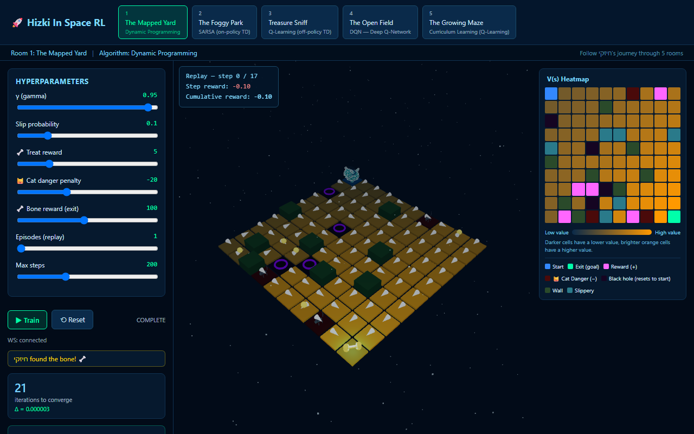
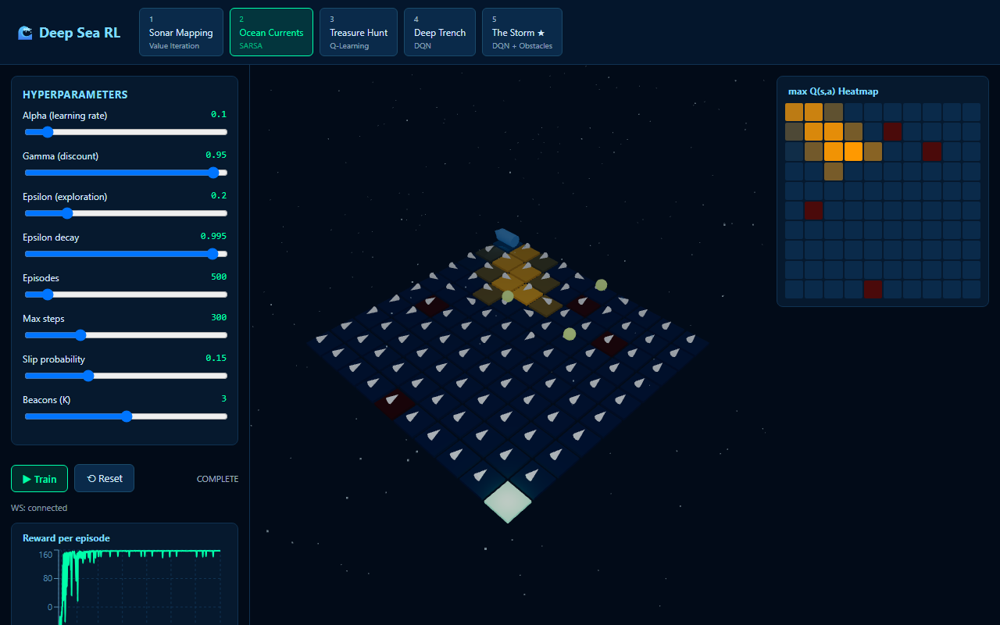
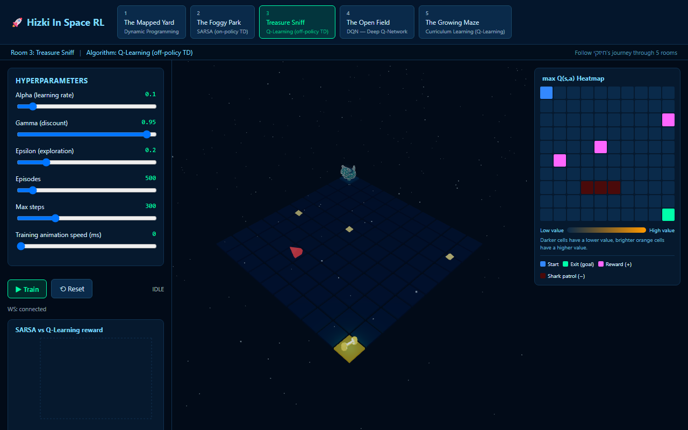
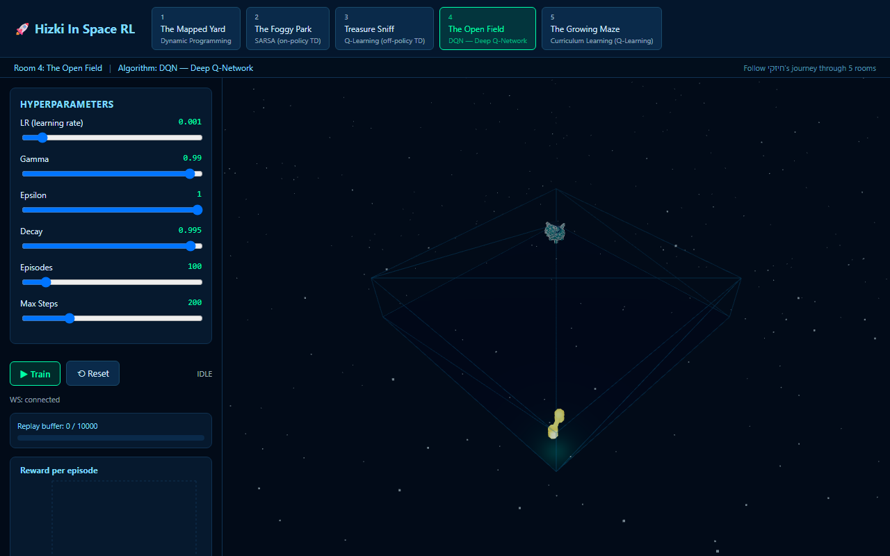
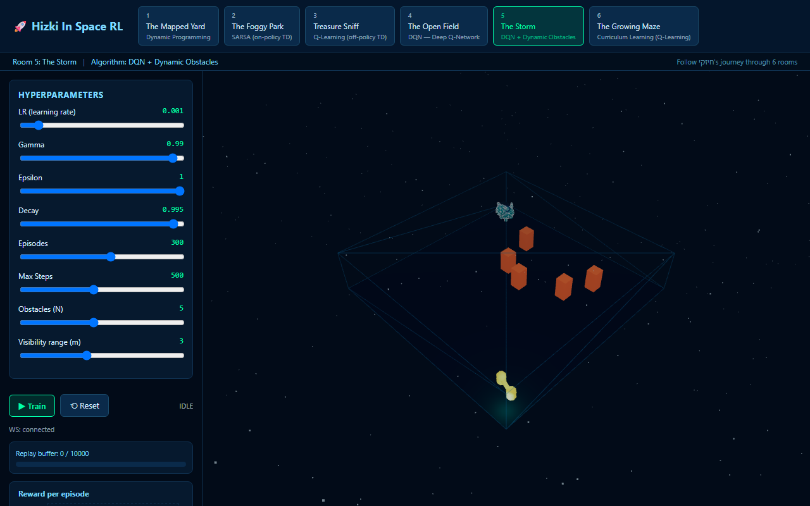
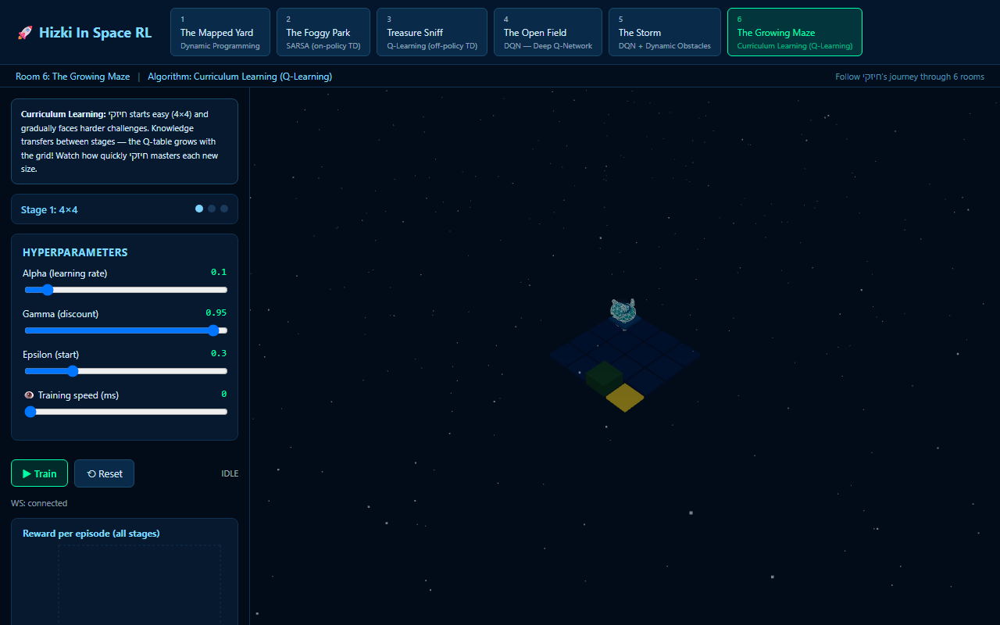

# Hizki In Space RL

A reinforcement-learning escape room game. The agent is **חיזקי (Khizki)**, a space-suited dog, who progresses through 6 rooms looking for a bone — each room is a different RL algorithm solving a different kind of environment. Wherever the underlying RL formulation refers to a terminal "exit" state, the 3D scene renders it as a glowing, rotating bone that חיזקי is trying to reach. Backend is FastAPI + WebSocket + NumPy + PyTorch; frontend is React + Three.js (`@react-three/fiber`) + Recharts.

```
backend/   FastAPI app, WebSocket protocol, one room module per algorithm
frontend/  React + Vite + Three.js UI, one page per room
```

## Running it

```bash
# backend
cd backend
python -m venv venv
./venv/Scripts/python.exe -m pip install -r requirements.txt
./venv/Scripts/python.exe main.py  # not `uvicorn main:app` - this picks up the longer websocket ping timeout needed for long DQN runs (see Room 4/5)

# frontend
cd frontend
npm install
npm run dev
```

Open the printed Vite URL (default `http://localhost:5173`). Each room has its own hyperparameter sliders, a Train/Pause/Reset control, live charts, and an episode replay scrubber.

---

## Reading the Q/V-value heatmap

Rooms 1-3 show a 10×10 heatmap next to the 3D scene. Most cells are colored by a **gradient**: dark navy blue is the lowest learned value anywhere in the table, orange/gold is the highest, and everything in between is a linear blend. That gradient is the *only* thing color means for a plain cell - there's no inherent meaning to "blue" or "orange" beyond "low" and "high" relative to this specific table right now.

A handful of cells instead get a **fixed marker color**, regardless of their value, so they stay identifiable no matter how the gradient happens to fall that run:

| Color | Meaning |
|---|---|
| 🔵 blue | Start |
| 🟢 green | Exit (goal) |
| 🟣 magenta/pink | Reward (+) - a beacon / treat / artifact, depending on the room |
| 🔴 dark red | Danger (−) - a trap, or a shark patrol cell |
| 🟦 teal | Slippery (vent) - the chosen action has a chance of being overridden by a random one here |

Hovering any cell shows its exact value and, for a marker cell, which one it is.

---

## Room 1 — The Mapped Yard (Dynamic Programming / Value Iteration)

**State space.** `s = (row, col)` on a 10×10 grid — 100 states. The transition model (including thermal-vent slip probabilities and electric-trap resets) is fully known and given to the planner; this is the one room that is **not** model-free.

**Action space.** 4 discrete actions: `UP, DOWN, LEFT, RIGHT`.

**Reward function.**
```
R(s,a,s') =  +100   if s' = exit (terminal)
             -20    if s' = trap (then s' is overridden to start)
             -0.1   otherwise (per-step time penalty)
```
Walls keep the agent in place (`s' = s`, reward −0.1). Thermal vent cells redirect the intended action to a uniformly random *other* action with probability `slip_prob`.

**Algorithm.** Value Iteration:
```
V_{k+1}(s) = max_a  Σ_s' P(s'|s,a) [ R(s,a,s') + γ V_k(s') ]
π(s)       = argmax_a  Σ_s' P(s'|s,a) [ R(s,a,s') + γ V_k(s') ]
```
repeated until `max_s |V_{k+1}(s) − V_k(s)| < θ`.

**Hyperparameters found to work well.**

| Param | Value | Why |
|---|---|---|
| γ | 0.95 | Long enough horizon to value reaching the exit from any cell on a 10×10 grid without numerical issues. |
| θ | 1e-4 | Converges in ~20 iterations (see chart) — tighter thresholds cost more iterations for visually identical policies. |
| slip_prob | 0.1 | Low enough that the optimal policy still mostly threads through vents on the shortest path rather than detouring around them. |

**Learning curve.**



**Key insight.** Because the model is known, Value Iteration doesn't "fear" stochastic vent cells the way a model-free learner would — it computes the *exact* expected return through them and routes the optimal policy straight through vents whenever the expected detour cost exceeds the slip risk, something visible in the policy arrows cutting through vent cells rather than around them.

---

## Room 2 — The Foggy Park (SARSA)

**State space.** `s = (row, col, beacons_visited)` where `beacons_visited ∈ {0,...,K}` is how many beacons have been collected *in order* (the bitmask is always a contiguous prefix since out-of-order visits don't advance it) — `100 × (K+1)` states.

**Action space.** 4 discrete actions, chosen ε-greedily.

**Reward function.**
```
R =  +100   reaching exit, only if all K beacons collected (terminal)
     +20    visiting the next beacon in sequence
      0     visiting a beacon out of order (no state change)
     -15    stepping on a trap (then position resets to start)
     -0.1   otherwise
```
Slip cells use the same stochastic-redirect mechanic as Room 1, but here the transition model is **not** given to the agent — it has to learn the dynamics from experience.

**Algorithm.** SARSA (on-policy TD control):
```
a' ~ ε-greedy(Q, s')
Q(s,a) ← Q(s,a) + α [ r + γ Q(s',a') − Q(s,a) ] 
```
The key on-policy property: the bootstrap target uses the action the agent *will actually take* next (including exploration), not the greedy action.

**Hyperparameters found to work well.**

| Param | Value | Why |
|---|---|---|
| α | 0.1 | Standard starting point; stable without being too slow on an 800-ish state space. |
| γ | 0.95 | Beacons can be several steps apart — needs enough lookahead to value the in-order bonus chain. |
| ε / decay | 0.2 / 0.995 | Decays to near-greedy by episode ~400, which is enough exploration to discover the beacon order without wasting episodes once it's learned. |
| K_beacons | 3 | Matches the default grid size well; higher K with the default 10×10 grid starts to make beacon placement collide too often. |

**Learning curve.**



**Key insight.** SARSA's on-policy bootstrap makes it visibly more cautious near traps and slip cells than the off-policy Q-Learning in Room 3 — because its TD target already accounts for its own (occasionally exploratory, occasionally unlucky) future action, it tends to learn paths with a bit more clearance around risky cells rather than the tightest possible route.

---

## Room 3 — Treasure Sniff (Q-Learning, vs. SARSA comparison)

**State space.** `s = (row, col, artifacts_bitmask)`, `artifacts_bitmask ∈ {0,...,2^M-1}` — fragments can be collected in **any** order, so the full bitmask (not just a count) is needed.

**Action space.** 4 discrete actions, ε-greedy.

**Reward function.**
```
R =  +100   reaching exit with all M artifacts collected (terminal)
     +15    collecting a not-yet-collected artifact fragment
     -25    stepping on the shark's current cell (terminal-of-attempt: resets to start)
     -0.1   otherwise (portal step also costs -0.1, then teleports the agent 3-5 cells toward the exit)
```
The shark patrols a fixed back-and-forth path, advancing one cell every `shark_speed` steps. A single-use portal is placed at a random cell each episode.

**Algorithm.** Q-Learning (off-policy TD control), trained head-to-head against SARSA on the same dynamics each episode:
```
Q(s,a) ← Q(s,a) + α [ r + γ max_a' Q(s',a') − Q(s,a) ]
```
The bootstrap uses the **greedy** action at `s'` regardless of which action the behavior policy actually takes next — this is what lets it propagate the value of a newly-discovered shortcut (like the portal) back through the Q-table faster than SARSA, which has to wait for its on-policy action sequence to line up.

**Hyperparameters found to work well.**

| Param | Value | Why |
|---|---|---|
| α | 0.1 | Same reasoning as Room 2. |
| γ | 0.95 | Needed to value the artifact chain + exit several steps out. |
| ε / decay | 0.3 / 0.99 | A faster decay than Room 2 — Q-Learning's off-policy bootstrap tolerates less exploration time before exploiting well, so decaying faster reaches a stable, mostly-greedy policy without wasting episodes. |
| M_fragments | 3 | Keeps the bitmask small (8 states) while still showing multi-objective collection behavior. |
| shark_speed | 3 | Slow enough to be avoidable with a learned policy, fast enough to actually threaten naive paths. |

**Learning curve.**



**Key insight.** In every run, Q-Learning discovers and starts exploiting the portal shortcut before SARSA does (see the "Portal first used at episode N" badge and the convergence-speed label under the chart) — direct, visible evidence of the textbook off-policy vs. on-policy convergence-speed difference.

---

## Room 4 — The Open Field (DQN, continuous control)

**State space.** Continuous `s = (x, y, Vx, Vy)`, with `x, y` normalized to `[-1, 1]` and `Vx, Vy` scaled by a fixed constant for stable network inputs (see *Key insight*).

**Action space.** 9 discrete thrust combinations: `(tx, ty)` for `tx, ty ∈ {-1, 0, 1}`.

**Reward function.**
```
R =  +100   entering the exit zone (circle, radius 0.5m at (9,9)), terminal
     -10    hitting a wall (velocity reset to 0)
     -0.05  otherwise
```

**Physics.** Each step: `v ← v·drag + thrust`, `pos ← pos + v·dt` (`dt = 0.02s`).

**Algorithm.** DQN with a target network and experience replay:
```
L(θ) = MSE( Q_θ(s,a),  r + γ (1-done) max_a' Q_θ⁻(s',a') )
```
`θ⁻` (target network) is synced from the online network `θ` every `target_sync` steps; both networks are the 2-hidden-layer, 128-unit MLP specified in `models/dqn_network.py`.

**Hyperparameters found to work well.**

| Param | Value | Why |
|---|---|---|
| learning_rate | 1e-3 | Adam default order of magnitude; stable for this network size. |
| γ | 0.99 | After the velocity/position rescale (see below), the optimal path is ~60-90 steps — γ=0.99 keeps the terminal reward's discounted value meaningful at that horizon (γ=0.95 would have discounted it away). |
| ε_decay / ε_min | 0.995 / 0.01 | Reaches near-greedy by episode ~250-300, matching when the policy has typically converged. |
| target_sync | 100 | Frequent enough to track the online network without the bootstrap target whipsawing every step. |
| drag | 0.85 | Gives חיזקי believable inertia without making fine control of the final approach to the bone too hard. |

**Learning curve.**



**Key insight.** The spec's literal physics constants (`dt = 0.02s`, velocity nominally in `[-1, 1]`) make the optimal path roughly **400+ steps** long — far beyond DQN's effective planning horizon at γ=0.99 (~100 steps), and training stalled with no improvement even after 150 episodes. Rescaling the velocity update to `v ← v·drag + thrust` (instead of `v·drag + thrust·(1-drag)`) raises the steady-state speed roughly 7×, shortening the optimal path to ~60-90 steps — well inside the effective horizon — after which the agent converges cleanly to ~95 reward within the default 300 episodes. This is a good illustration of why a long action-to-reward horizon (not just a hard environment) can outright break a sparse-reward agent's ability to learn at all.

---

## Room 5 — The Bone Machines (Multi-Armed Bandit)

**State space.** None — this is a *stateless* bandit problem, the simplest RL setting: there's no position, no episode, just "which of 3 actions gives the best average reward?"

**Action space.** Pull one of 3 machines.

**Reward function.** Pulling machine `i` returns a Bernoulli reward: `1.0` ("a bone!") with the machine's hidden probability `true_probs[i]`, else `0.0`. The 3 probabilities are randomized (and hidden) every time the room is reset.

**Interaction model.** Unlike every other room, there's no Train button here - you click a machine yourself to pull its lever (with a 0.5s spin before the result reveals), or flip on "Let חיזקי play" to have him auto-pull every 300ms using epsilon-greedy. Either way, every single pull goes through the same `single_pull` WebSocket message and updates Q-values live; the original auto-training loop (`start_training` / `train()`) is still there server-side as a fallback, just no longer wired to any button.

**Algorithm — epsilon-greedy with incremental-mean Q-values.** No transition model, no bootstrapping: `Q(a) += α · (reward − Q(a))` after every pull. Manual clicks always pull exactly the machine you clicked; epsilon only governs the autoplay toggle's own choice (`argmax Q(a)` to exploit, except with probability `epsilon`, where it picks a uniformly random machine to explore instead). This is the simplest possible illustration of the explore/exploit trade-off that every other room's epsilon-greedy step is also making, just without any state or environment dynamics around it.

**Hyperparameters found to work (reasonably) well.**

| Param | Value | Why |
|---|---|---|
| epsilon | 0.2 | Used only by the autoplay toggle. High enough to keep sampling all 3 machines early on (so a machine that's merely *unlucky* on its first pull isn't abandoned forever), low enough to mostly exploit once Q-values separate. |
| alpha | 0.1 | A fixed (rather than `1/n`) learning rate, so Q-values keep adapting slightly even late in the round rather than fully freezing. |
| n_pulls | 200 (fixed) | Enough pulls for the Q-value estimates to clearly separate and converge toward the true probabilities at this epsilon/alpha; once reached, the true probabilities are revealed and pulling locks until Reset. |

**Learning curve.**



**Key insight.** Because there's no state to generalize across, this room makes the *cost of exploration* directly visible: every pull spent on a low-probability machine is a pull not spent exploiting the best one, yet without those exploratory pulls the agent can't tell early luck from a genuinely good machine. Watching the three Q-value lines separate and converge toward the (afterward-revealed) true probabilities is a direct visualization of that resolving over time.

---

## Room 6 — The Growing Maze (Curriculum Learning)

**State space.** `(row, col)` — but on a grid whose size *changes between stages*: 4×4, then 6×6, then 10×10.

**Action space.** 4 grid moves (UP/DOWN/LEFT/RIGHT).

**Reward function.**
```
R =  +100   reaching the exit, terminal
     -0.1   otherwise (step cost)
```

**Dynamics.** Each stage randomizes its own walls (10% of cells) and slip probability (`0.0 → 0.1 → 0.15` across stages 1-3), so later stages are harder both because they're bigger *and* because they're more stochastic.

**Algorithm — Q-Learning with Q-table transfer between stages.** Standard off-policy Q-Learning runs within each stage. When a stage finishes, the Q-table isn't thrown away: it's copied into the top-left `old_size × old_size` corner of a freshly-zeroed `new_size × new_size` table before the next stage begins, so whatever חיזקי already learned about navigating that region of the grid carries forward instead of starting from scratch.

**Hyperparameters found to work (reasonably) well.**

| Param | Value | Why |
|---|---|---|
| episodes per stage | 100 / 150 / 250 | Each stage needs enough episodes to converge at its own size and slip probability; later (bigger, slippier) stages get proportionally more. |
| epsilon_decay | 0.99 (fixed, not exposed) | Decays slowly enough that exploration carries over meaningfully into the next stage rather than bottoming out mid-stage. |

**Learning curve.**



**Key insight.** Because walls are re-randomized every stage, the transferred Q-values aren't always still correct for the new layout (a learned "this is the fast path" might now run into a wall) — but they're still a far better starting point than zeros, since most of the *general* navigation skill (e.g. "head toward higher row/col") still applies. The reward chart's per-stage divider lines make this visible directly: each stage starts above where the previous stage started, even though the grid just got bigger and harder.

---

## WebSocket protocol summary

Single endpoint per room: `ws://localhost:8000/ws/{room_id}` (room_id 1-6).

Client → server: `start_training`, `pause_training`, `resume_training`, `reset`, `get_replay`, `single_pull` (Room 5 only - `{ type: "single_pull", machine: 0|1|2, params: {...} }`).

Server → client: `room_info` (static/preview map data, sent on connect and at training start), `vi_iteration` (Room 1 only), `step_update`, `episode_end`, `training_complete`, `replay_data`, `error`, `pull_result` (Room 5 - sent per pull, with `done`/`true_probs`/`best_machine` once the pull cap is reached), `stage_start` (Room 6 only).
